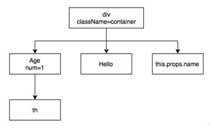

# 学习成果(第一周)

---

## 一、React与前端

### 1.1 前端简史

#### 1.1.1 Web 1.0

Web 的内容由网站制作者生成，用户只能浏览内容，信息的流动方向只能从服务端到客户端，这一阶段被称为 Web 1.0 时代。

**简单来说就是用 HTML+CSS+JS 做成的网页** 我大学的时候觉得学这三个就够了，前两个还特别简单，于是就入了前端的坑。

#### 1.1.2 Web 2.0

Web 的内容主要由用户生成，用户浏览其他用户创造的内 容，这一阶段统称为 Web 2.0 时代。

一种被称为 **AJAX** 的名词被发明一一页面需要更新，JavaScript 向服务器发起请求，服务端不再返回页面，而是返回 XML 格式的数据，然后 JavaScript 将数据渲染到页面中。
prototype.js、Dojo、ExtJS、jQuery、YUI 3这些 JavaScript 库，和AMD、CMD、CommonJS这些模块打包工具 都是这一时代的技术产物。

后端的 MVC 不适合前端，于是有了 MVP、MVVM 典型的有Backbone.js、Knockout、AngularJS，直到React发布，它是专注于视图（V）层的，一种全新的思路带到了我们面前，新的时代到来。

### 1.2 React


React把用户界面抽象成一个个组件，开发者通过组合这些组件，最终得到功能丰富、可交互的页面。通过引入 JSX 语法，复用组件就变得容易，同时也可以保证组件结构清晰。有了组件这层抽象，React 实现了把代码和真实渲染目标分隔开来。

**React 的核心是组件**
> 组件设计的目的
> * 提高代码复用率 &emsp;&emsp;组件将数据和逻辑封装，类似面向对象的类
> * 降低测试难度 &emsp;&emsp;&emsp;组件高内聚低耦合，很容易对单个组件进行测试
> * 降低代码复杂度 &emsp;&emsp;直观的语法提高了可读性
>   > 注：
>   > 高内聚：每一个组件专注做自己的功能
>   > 低耦合：组件之间耦合度低，不会相互有太大影响

**React 的精髓是函数式编程**
> 主要思想是把运算过程尽量写成一系列嵌套的函数进行调用
> * 代码简单，开发快速 &emsp;&emsp;&emsp;&emsp;因为它把逻辑开发运算过程尽可能地写成了一系列嵌套函数，进行调用
> * 接近自然语言，易于理解 &emsp;&emsp;JS函数式的开发语言
> * 更方便的代码管理 &emsp;&emsp;&emsp;&emsp;&emsp;封装函数使得后期修改更加方便
> * 易于“并发编程” &emsp;&emsp;&emsp;&emsp;&emsp;&emsp; 可以同时进行很多函数的声明和操作
> * 代码的热升级 &emsp;&emsp;&emsp;&emsp;&emsp;&emsp;&emsp;浏览器无刷新的情况下自动更新
> * 是简单函数，易于测试

**React 的另一特点是虚拟 DOM**

> React 使用 Virtual DOM（虚拟DOM）技术，使得它性能卓越，开销很小。
> 
> Virtual DOM 是 React 中的一个很重要的概念，在日常开发中，前端工程师们需要将后台的的数据呈现到界面中，同时要能对用户的操作提供反馈，作用到UI上···这些都离不开DOM操作。但频繁的DOM操作会造成极大的资源浪费，也通常是性能瓶颈的原因。于是 React 引入了 Virtual DOM。Virtual DOM 的核心就是计算比较改变前后的 DOM 区别，然后用最少的 DOM 操作语句对 DOM 进行操作。
>
> 而 Virtual DOM 中使用了 DIFF 算法技术，DIFF 算法是一个比较计算的算法，主要用来计算比较 DOM 之间的差异。例如：
>
> 
>
> 只需要移动三个节点即可。

**React 的语法糖是 JSX**

> React 中使用 JSX 语法糖，JSX = JavaScript + XML。可在js文件中写 HTML 模板，代码语境不需要来回切换。

**总结：**
React是一次完整的抽象，改变了我们的思考、设计和写代码的方式
React是一次完整的统一，统一了以前很多种编写界面的方式
声明式、基于组件、一次学习 多端受用是它的三大特色

家族：React、Redux、React Router、React Native

*以上几点我会在后面的文档中详细介绍*

---

## 二、深入浅出React

### 2.1 组件

React中有两种组件：函数组件(Functional Components) 和类组件(Class Components)，有以下四种方式定义组件


#### 2.1.1 createClass

```javascript
var React = require ('react');

var Hello= React.createClass({
  propTypes: {
	name : React.PropTypes string // 后面的文档会详细介绍PropTypes
  },
  getDefaultProps : function () {
	return { name: 'zhu' }
  },
  getInitialState : function () {
	return { count: 1 }
  },
  render : function () {
	return <div>hello {this.props.name} {this.state count}</div>;
  }
});
```
上面的代码会创建一个 Hello 组件，其中涉及了属性、状态和 render 函数
创建组件后就可以将其渲染到 DOM 中。
```javascript
var ReactDOM = require ('react-dom');
ReactDOM.render(
  <Hello /> ,
  document.getElementById('root')
);
```

#### 2.1.2 Component

```javascript
import React from 'react';

class Hello extends React.Component {
  static propTypes = {
	name : React.PropTypes.string
  }
  static defaultProps = {
	name: 'zhu'
  }
  constructor(props) {
	super(props);
	this.state = {count : 1};
  }
  render() {
	return <div>hello {this.props.name} {this.state.count}</div>; 
  }
}
```

#### 2.1.3 Functional Component 

```javascript
import React from 'react';

function Hello ({ name }) {
  return <div>{name}</div>
Hello.propTypes = {
  name: React.PropTypes.string
};
Hello.defaultProps = {
  name: 'zhu'
};

```

#### 2.1.4 PureComponent 

```javascript
class Demo1 extends Component {
  shouldComponentUpdate(nextProps, nextState) {
	const { props, state } = this;
	function shallowCompare(a, b) {
	  return a === b || Object.keys(a).every(k => a[k] === b[k]);
	}
	return shallowCompare(nextProps, props) && shallowCompare (nextState, state);
  }
}
class Demo2 extends PureComponent {} 
```

**对比：**
> **1. createClass vs Component**
对于React.createClass 和 extends React.Component本质上都是用来创建组件，他们之间并没有绝对的好坏之分，只不过一个是ES5的语法，一个是ES6的语法支持，因为ES6对类和继承有语法级别的支持，所以用ES6创建组件的方式更加优雅。而且 createClass 支持定义 PureRenderMixin，这种写法官方已经不再推荐，而是建议使用 PureComponent
**2. PureComponent vs Component**
PureComponent 已经定义好了shouldUpdateComponent 而 Component 需要显示定义
**3. Component vs Stateless Functional Component**
(1) Component 包含内部 state，而 Stateless Functional Component 所有数据都来自 props，没有内部state
(2) Component 包含的一些生命周期函数，Stateless Functional Component 都没有，因为 Stateless Functional Component 没有 shouldComponentUpdate，所以也无法控制组件的渲染，也即是说只要是收到新的props，Stateless Functional Component 就会重新渲染。
(3) Stateless Functional Component 不支持Refs

**总结：**
> - 如果环境支持ES6，那么应该使用Component
> - 如果环境不支持ES6，那么应该使用createClass
> - 如果组件没有自身状态，那么应该使用Functional Component
> - 如果组件是纯组件，那么应该使用PureComponent

### 2.2 JSX

#### DOM 向 JSX 的演进
网页由 DOM 元素构成。React DOM 并不是浏览器的 DOM，而是 React DOM 只是用来告诉浏览器如何创建 DOM 的方法。通常情况下，我们并不需要 React 就能创建出一个 DOM 元素，但是 React 创建与管理 DOM 的方式有组件化、虚拟 DOM 等更高层次的抽象，由此带来的优势是更快的渲染速度，以及更好的维护性，因此值得去尝试。在传统网页中，使用 document.createElement 来添加 DOM 元素，在 React 中可以使用 React.createElement 和 JSX 两种方式来实例化组件。

### 2.2.1 document.createElement

```javascript
const title = document.createElement('h1');
title.innerText='Hello React (method 1)';
title.className='main';
document.getElementById('root').appendChild(title);
```

### 2.2.2 React.createElement

```javascript
React.createElement(
  type,
  [props],
  [...children]
)
```

其中 createElement(a, b, c)

- 第一个参数 a（必填）：代表类型，可以是 HTML 标签或者 React 组件类型，HTML 标签都用小写字母表示，如 div、span等；而React 组件必须以大写字母开头，如 Hello。
- 第二个参数 b（选填）：代表传给组件的属性，是一个对象。
- 第三个参数 c（选填）：代表这个元素的子元素，每个子元素都可以是文本值或者 React 元素，可以继续嵌套另外一个 React.createElement(a, b, c)。

```javascript
React.createElement(
  "div",
  { className: "container" },
  React.createElement(
	Age,
	{ num: "1" },
	"th"
  ),
  "Hello ",
  this.props.name
);
```
用图来表示更容易理解


### 2.2.3 JSX 语法糖

上面的代码，用 JSX 表示上面的逻辑，仅仅需要4行代码，同时也更容易理解，和前端熟悉的HTML非常相似。
```javascript
<div className="container">
  <Age num="1">th</Age>
  Hello {this.props.name}
</div>
```

JSX 不能直接运行，是被 babel-loader 中的 react 这个 preset 翻译成 createElement 那种形式


需要注意：

1、**必须被一个单独的大标签包裹**，比如 div 或者 section

错误：

```javascript
return <h1>Hello World!</h1>
<h1>Hello World!</h1>;
```

正确：

```javascript
return (
	<div>
		<h1>Hello World!</h1>
		<h1>Hello World!</h1>
	</div>
);
```

2、**标签必须封闭**

错误：

```javascript
return (
	<div>
		
	</div>
);
```

正确：

```javascript
return (
	<div>
		
	</div>
);
```

3、**class 要写成 className，for 要写成 htmlFor**

错误：

```javascript
return (
	<div>
		<div class="box" ></div>
	</div>
);
```

正确：

```javascript
return (
	<div>
		<div className="box" ></div>
	</div>
);
```

4、HTML注释不能使用，只能使用JS注释

5、**原生标签比如p、li、div如果要使用自定义属性，必须用data-前缀**

错误：

```javascript
return (
	<div>
		<div className="box" ></div>
  		<p a="10"></p>
	</div>
);
```

正确：

```javascript
return (
	<div>
		<div className="box" ></div>
  		<p data-a="10"></p>
	</div>
);
```

如果是自定义标签，此时可以随便传属性：

```javascript
<App a="12321"></App>
```

6、**JS表达式用{}单大括号包裹**，在 JSX 中不能使用 if else 语句，但可以使用 conditional (三元运算) 表达式来替代

```javascript
<h1>Hello World!{1+2}</h1>

{3 > 8 ? "A" : "B"}
```

7、**可以运行函数**


8、**样式使用双大括号**


9、**可以使用数组**
数组中如果是 JSX 语法，数组会被自动展开

```javascript
import React from 'react';

class App extends React.Component {
  render() {
    let arr = ["APPLE", "MI", "HUAWEI", "VIVO"].map((item, index) => {
      return <li key={index}>{item}</li>
    })
    return(
      <div>
        <h1>Hello World</h1>
        <ul>
          {arr}
        </ul>
      </div>
    )
  }
}
export default App;
```

*注意：每一个处于数组中的 JSX 结构，必须加上key属性*


**总结：**
> JSX最终要被编译为 createElement才能够在浏览器里执行，平时写代码时一定要用JSX，研究背后的原理一定要看createElement

