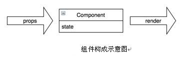
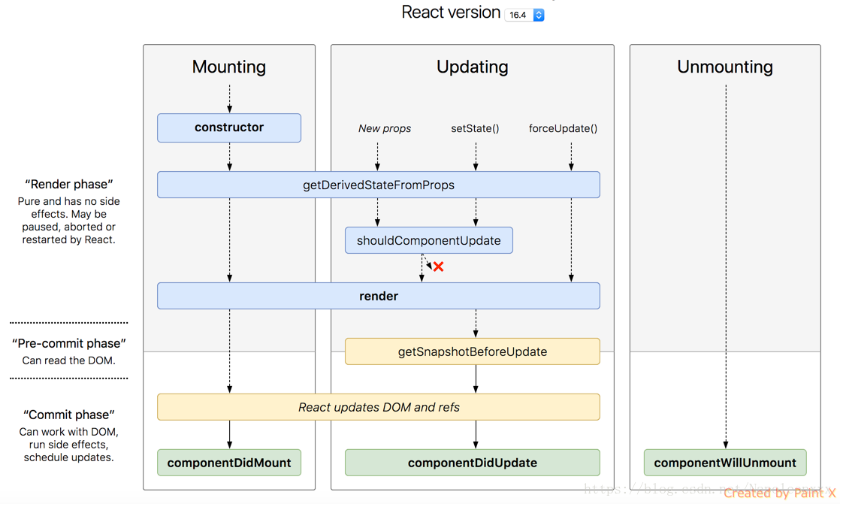
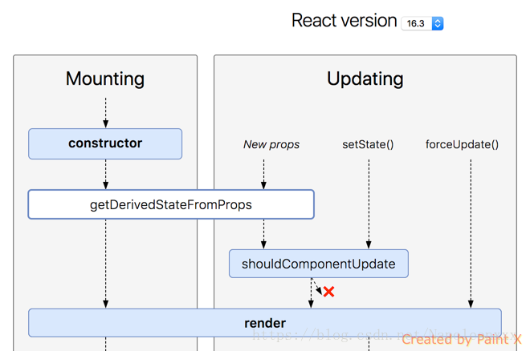
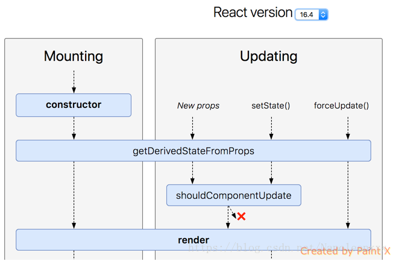
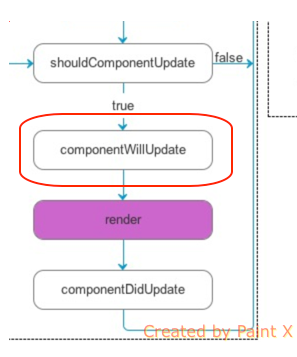
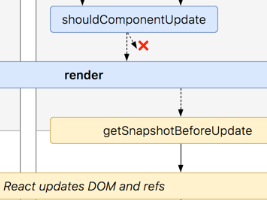
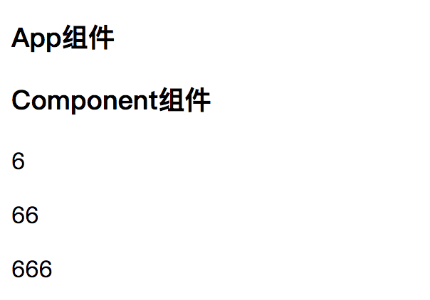
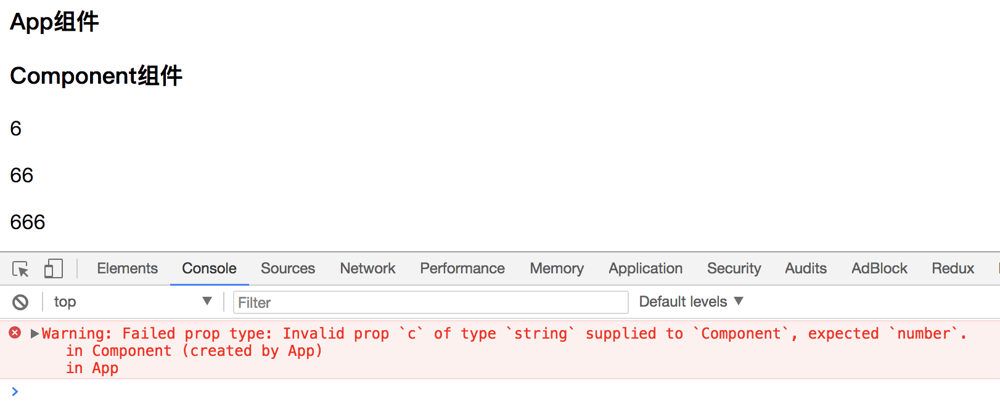
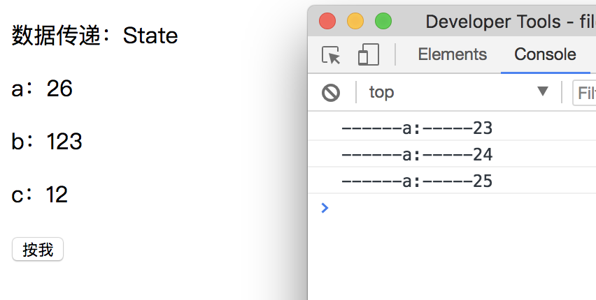

# React 前端扫盲

---

## 一、React与前端

### 1.1 前端简史

#### 1.1.1 Web 1.0

Web 的内容由网站制作者生成，用户只能浏览内容，信息的流动方向只能从服务端到客户端，简单来说就是用 HTML+CSS+JS 做成的网页，这一阶段被称为 Web 1.0 时代。

#### 1.1.2 Web 2.0

Web 的内容主要由用户生成，用户浏览其他用户创造的内 容，这一阶段统称为 Web 2.0 时代。

一种被称为 **AJAX** 的名词被发明一一页面需要更新，JavaScript 向服务器发起请求，服务端不再返回页面，而是返回 XML 格式的数据，然后 JavaScript 将数据渲染到页面中。
prototype.js、Dojo、ExtJS、jQuery、YUI 3这些 JavaScript 库，和AMD、CMD、CommonJS这些模块打包工具 都是这一时代的技术产物。

后端的 MVC 不适合前端，于是有了 MVP、MVVM 典型的有Backbone.js、Knockout、AngularJS，直到React发布，它是专注于视图（V）层的，一种全新的思路带到了我们面前，新的时代到来。

### 1.2 React


React把用户界面抽象成一个个组件，开发者通过组合这些组件，最终得到功能丰富、可交互的页面。通过引入 JSX 语法，复用组件就变得容易，同时也可以保证组件结构清晰。有了组件这层抽象，React 实现了把代码和真实渲染目标分隔开来。

**React 的核心是组件**
> 组件设计的目的
> * 提高代码复用率 &emsp;&emsp;组件将数据和逻辑封装，类似面向对象的类
> * 降低测试难度 &emsp;&emsp;&emsp;组件高内聚低耦合，很容易对单个组件进行测试
> * 降低代码复杂度 &emsp;&emsp;直观的语法提高了可读性
>   > 注：
>   > 高内聚：每一个组件专注做自己的功能
>   > 低耦合：组件之间耦合度低，不会相互有太大影响

**React 的精髓是函数式编程**
> 函数式编程主要思想是把运算过程尽量写成一系列嵌套的函数进行调用
> * 代码简单，开发快速 &emsp;&emsp;&emsp;&emsp;因为它把逻辑开发运算过程尽可能地写成了一系列嵌套函数，进行调用
> * 接近自然语言，易于理解 &emsp;&emsp;JS函数式的开发语言
> * 更方便的代码管理 &emsp;&emsp;&emsp;&emsp;&emsp;封装函数使得后期修改更加方便
> * 易于“并发编程” &emsp;&emsp;&emsp;&emsp;&emsp;&emsp; 可以同时进行很多函数的声明和操作
> * 代码的热升级 &emsp;&emsp;&emsp;&emsp;&emsp;&emsp;&emsp;浏览器无刷新的情况下自动更新
> * 是简单函数，易于测试

**React 的另一特点是虚拟 DOM**

> React 使用 Virtual DOM（虚拟DOM）技术，使得它性能卓越，开销很小。
> 
> Virtual DOM 是 React 中的一个很重要的概念，在日常开发中，前端工程师们需要将后台的的数据呈现到界面中，同时要能对用户的操作提供反馈，作用到UI上···这些都离不开DOM操作。但频繁的DOM操作会造成极大的资源浪费，也通常是性能瓶颈的原因。于是 React 引入了 Virtual DOM。Virtual DOM 的核心就是计算比较改变前后的 DOM 区别，然后用最少的 DOM 操作语句对 DOM 进行操作。
>
> 而 Virtual DOM 中使用了 DIFF 算法技术，DIFF 算法是一个比较计算的算法，主要用来计算比较 DOM 之间的差异。例如：
>
> 
>
> 只需要移动三个节点即可。

**React 的语法糖是 JSX**

> React 中使用 JSX 语法糖，JSX = JavaScript + XML。可在js文件中写 HTML 模板，代码语境不需要来回切换。

**总结：**
React是一次完整的抽象，改变了我们的思考、设计和写代码的方式
React是一次完整的统一，统一了以前很多种编写界面的方式
声明式、基于组件、一次学习 多端受用是它的三大特色

家族：React、Redux、React Router、React Native

---

## 二、深入浅出React

### 2.1 组件

组件是React的核心，也是React的精髓。组件有输入、自己的状态和输出，输入在React中叫作props，自己的状态在React中叫作state，输出在React中是render函数返回的值。

组件必须先定义，然后才能使用。React组件的定义方式也经历过几次进化，如下。

#### 2.1.1 createClass

```javascript
var React = require ('react');

var Hello= React.createClass({
  propTypes: {
	name : React.PropTypes string // 后面的文档会详细介绍PropTypes
  },
  getDefaultProps : function () {
	return { name: 'zhu' }
  },
  getInitialState : function () {
	return { count: 1 }
  },
  render : function () {
	return <div>hello {this.props.name} {this.state count}</div>;
  }
});
```
上面的代码会创建一个 Hello 组件，其中涉及了属性、状态和 render 函数
创建组件后就可以将其渲染到 DOM 中。
```javascript
var ReactDOM = require ('react-dom');
ReactDOM.render(
  <Hello /> ,
  document.getElementById('root')
);
```

#### 2.1.2 Component

```javascript
import React from 'react';

class Hello extends React.Component {
  static propTypes = {
	name : React.PropTypes.string
  }
  static defaultProps = {
	name: 'zhu'
  }
  constructor(props) {
	super(props);
	this.state = {count : 1};
  }
  render() {
	return <div>hello {this.props.name} {this.state.count}</div>; 
  }
}
```

#### 2.1.3 Functional Component 
有些组件有自身状态，比如交互类组件；有些组件没有自身状态，比如纯展示类组件。
函数式组件就是一个普通函数，其参数是一个对象，在被调用时就是传入的 props ，配合函数参数的解构使用起来非常优雅。函数式组件的属性默认值和属性类型只能通过函数的属性定义。
其实 class 定义的类也是一个函数，函数式组件只是缺少了继承 React.Component 。
然而，上面的方法并没有对两种组件做出区分，没有自身状态的组件，被称为无状态组件(stateless)，对于无状态组件上面的方法有些影响性能。

```javascript
import React from 'react';

function Hello ({ name }) {
  return <div>{name}</div>
Hello.propTypes = {
  name: React.PropTypes.string
};
Hello.defaultProps = {
  name: 'zhu'
};

```

#### 2.1.4 PureComponent 

在 React 内部 PureComponent 继承自 Component ，并将isPureReactComponent 属性设置为 true 。在 React 内部使用 isPureReactComponent 来区分是否是 PureComponent 组件。

PureComponent 和 Component 的功能几乎一样，但 PureComponent 的 shouldComponentUpdate 不会直接返回 true ，而是会对属性和状态进行浅层比较，也就是仅比较直接属性是否相等。

可以用 shouldComponentUpdate 模拟 PureComponent ，下面两个组件的功能一样。
```javascript
class Demo1 extends Component {
  shouldComponentUpdate(nextProps, nextState) {
	const { props, state } = this;
	function shallowCompare(a, b) {
	  return a === b || Object.keys(a).every(k => a[k] === b[k]);
	}
	return shallowCompare(nextProps, props) && shallowCompare (nextState, state);
  }
}
class Demo2 extends PureComponent {} 
```
React中有两种组件：函数组件(Functional Components) 和类组件(Class Components)，有以上四种方式定义组件。

**对比：**
> **1. createClass vs Component**
对于React.createClass 和 extends React.Component本质上都是用来创建组件，他们之间并没有绝对的好坏之分，只不过一个是ES5的语法，一个是ES6的语法支持，因为ES6对类和继承有语法级别的支持，所以用ES6创建组件的方式更加优雅。而且 createClass 支持定义 PureRenderMixin，这种写法官方已经不再推荐，而是建议使用 PureComponent
**2. PureComponent vs Component**
PureComponent 已经定义好了shouldUpdateComponent 而 Component 需要显示定义
**3. Component vs Stateless Functional Component**
(1) Component 包含内部 state，而 Stateless Functional Component 所有数据都来自 props，没有内部state
(2) Component 包含的一些生命周期函数，Stateless Functional Component 都没有，因为 Stateless Functional Component 没有 shouldComponentUpdate，所以也无法控制组件的渲染，也即是说只要是收到新的props，Stateless Functional Component 就会重新渲染。
(3) Stateless Functional Component 不支持Refs

**总结：**
> - 如果环境支持ES6，那么应该使用Component
> - 如果环境不支持ES6，那么应该使用createClass
> - 如果组件没有自身状态，那么应该使用Functional Component
> - 如果组件是纯组件，那么应该使用PureComponent

---

### 2.2 JSX

#### DOM 向 JSX 的演进
网页由 DOM 元素构成。React DOM 并不是浏览器的 DOM，而是 React DOM 只是用来告诉浏览器如何创建 DOM 的方法。通常情况下，我们并不需要 React 就能创建出一个 DOM 元素，但是 React 创建与管理 DOM 的方式有组件化、虚拟 DOM 等更高层次的抽象，由此带来的优势是更快的渲染速度，以及更好的维护性，因此值得去尝试。在传统网页中，使用 document.createElement 来添加 DOM 元素，在 React 中可以使用 React.createElement 和 JSX 两种方式来实例化组件。

### 2.2.1 document.createElement

```javascript
const title = document.createElement('h1');
title.innerText='Hello React (method 1)';
title.className='main';
document.getElementById('root').appendChild(title);
```

### 2.2.2 React.createElement

```javascript
React.createElement(
  type,
  [props],
  [...children]
)
```

其中 createElement(a, b, c)

- 第一个参数 a（必填）：代表类型，可以是 HTML 标签或者 React 组件类型，HTML 标签都用小写字母表示，如 div、span等；而React 组件必须以大写字母开头，如 Hello。
- 第二个参数 b（选填）：代表传给组件的属性，是一个对象。
- 第三个参数 c（选填）：代表这个元素的子元素，每个子元素都可以是文本值或者 React 元素，可以继续嵌套另外一个 React.createElement(a, b, c)。

```javascript
React.createElement(
  "div",
  { className: "container" },
  React.createElement(
	Age,
	{ num: "1" },
	"th"
  ),
  "Hello ",
  this.props.name
);
```
用图来表示更容易理解


### 2.2.3 JSX 语法糖

上面的代码，用 JSX 表示上面的逻辑，仅仅需要4行代码，同时也更容易理解，和前端熟悉的HTML非常相似。
```javascript
<div className="container">
  <Age num="1">th</Age>
  Hello {this.props.name}
</div>
```

JSX 不能直接运行，是被 babel-loader 中的 react 这个 preset 翻译成 createElement 那种形式


需要注意：

1、**必须被一个单独的大标签包裹**，比如 div 或者 section

错误：

```javascript
return (
  <h1>Hello World!</h1>
  <h1>Hello World!!</h1>
);
```

正确：

```javascript
return (
  <div>
    <h1>Hello World!</h1>
    <h1>Hello World!!</h1>
  </div>
);
```

2、**标签必须封闭**

错误：

```javascript
return (
  <div>
    
  </div>
);
```

正确：

```javascript
return (
  <div>
    
  </div>
);
```

3、**class 要写成 className，for 要写成 htmlFor**

错误：

```javascript
return (
  <div>
    <div class="box"></div>
  </div>
);
```

正确：

```javascript
return (
  <div>
    <div className="box"></div>
  </div>
);
```

4、不能使用HTML注释，要使用JSX注释
```javascript
render() {
  return (
    {/*1. 写在同一行*/}
    {/* 
      2. 多行注释
    */}
    {
      // 3. 单行注释
    }
  )
}
```

5、**原生标签比如p、li、div如果要使用自定义属性，必须用data-前缀**

错误：

```javascript
return (
  <div>
    <div className="box" ></div>
      <p a="10"></p>
  </div>
);
```

正确：

```javascript
return (
  <div>
    <div className="box" ></div>
      <p data-a="10"></p>
  </div>
);
```

如果是自定义标签，此时可以随便传属性：

```javascript
<App a="12321"></App>
```

6、**JS表达式用{}单大括号包裹**，在 JSX 中不能使用 if else 语句，但可以使用 conditional (三元运算) 表达式来替代

```javascript
<h1>Hello World!{1+2}</h1>

{3 > 8 ? "A" : "B"}
```

7、**可以运行函数**


8、**样式使用双大括号**


9、**可以使用数组**
数组中如果是 JSX 语法，数组会被自动展开

```javascript
import React from 'react';

class App extends React.Component {
  render() {
    let arr = ["APPLE", "MI", "HUAWEI", "VIVO"].map((item, index) => {
      return <li key={index}>{item}</li>
    })
    return(
      <div>
        <h1>Hello World</h1>
        <ul>
          {arr}
        </ul>
      </div>
    )
  }
}
export default App;
```

*注意：每一个处于数组中的 JSX 结构，必须加上key属性*


**总结：**
> JSX最终要被编译为 createElement才能够在浏览器里执行，平时写代码时一定要用JSX，研究背后的原理一定要看createElement


---

### 2.3 生命周期

#### 2.3.1 生命周期概述

每一个软件都会有诞生和死亡的一天， React 组件也有自己的生命周期，每一个 React 组件都会经历出生、存在和消亡的过程。组件从没有到创建，到被移除的完整生命周期，都提供了可以触发事件的函数接口，就是生命周期。React 为每个过程都提供了一些回调函数（称作钩子函数），让我们可以自定义一些内容。

组件的生命周期包含三个主要部分：

- 挂载(Mounting)： 组件被插入到 DOM 中。
- 更新(Updating)： 组件被重新渲染，查明 DOM 是否应该刷新。
- 移除/卸载(Unmounting)： 组件从 DOM 中移除。


下面是一个生命周期的例子，新建 src/Cycle.js：

```javascript
// 构造函数，在创建组件的时候调用一次。
constructor(props, context)

// 在组件挂载之前调用一次。如果在这个函数里面调用 setState ，本次的 render 函数可以看到更新后的 state ，并且只渲染一次。
UNSAFE_componentWillMount()

// 组件实例化后和接受新属性时将会调用getDerivedStateFromProps。它应该返回一个对象来更新状态，或者返回null来表明新属性不需要更新任何状态。注意，如果父组件导致了组件的重新渲染，即使属性没有更新，这一方法也会被调用。如果你只想处理变化，你可能想去比较新旧值。
static getDerivedStateFromProps(nextProps, prevState)

// 在组件挂载之后调用一次。这个时候，子主键也都挂载好了，可以在这里使用 refs 。
componentDidMount()

// props是父组件传递给子组件的。父组件发生 render 的时候子组件就会调用 componentWillReceiveProps （不管 props 有没有更新，也不管父子组件之间有没有数据交换）。
UNSAFE_componentWillReceiveProps(nextProps)

// getSnapshotBeforeUpdate()在最新的渲染输出提交给DOM前将会立即调用。它让你的组件能在当前的值可能要改变前获得它们。这一生命周期返回的任何值将会 作为参数被传递给componentDidUpdate()。
getSnapshotBeforeUpdate()

// 组件挂载之后，每次调用 setState 后都会调用 shouldComponentUpdate 判断是否需要重新渲染组件。默认返回 true ，需要重新 render 。在比较复杂的应用里，有一些数据的改变并不影响界面展示，可以在这里做判断，优化渲染效率。
shouldComponentUpdate(prevProps, prevState)

// shouldComponentUpdate 返回 true 或者调用 forceUpdate 之后， componentWillUpdate 会被调用。
UNSAFE_componentWillUpdate(nextProps, nextState)

// 除了首次 render 之后调用 componentDidMount ，其它 render 结束之后都是调用 componentDidUpdate 。
componentDidUpdate(prevProps, prevState, snapshot)

// render 是一个 React 组件所必不可少的核心函数（上面的其它函数都不是必须的）。记住，不要在 render 里面修改 state 。注意：若 shouldComponentUpdate()返回false，render()函数将不会被调用。
render()

// 组件被卸载的时候调用。一般在 componentDidMount 里面注册的事件需要在这里删除。
componentWillUnmount()

// 这个生命周期被调用是在某个后代组件已经抛出一个错误之后。它的一个参数接收被抛出的错误，并应该返回一个值去更新状态。注意：getDerivedStateFromError() 被调用是在 “渲染” 阶段，所以不允许副作用(side-effects)
static getDerivedStateFromError(error)

// 这个生命周期被调用是在某个后代组件已经抛出一个错误之后。它收到两个参数：error——被扔出的错误。info——一个对象，带有一个componentStack键。componentDidCatch()被调用是在“提交”期间阶段，所以允许副作用 (side-effects)，它应该用于记录错误等。注意：错误边界捕捉的错误只能是在树中低于它们的组件里，一个错误边界并不能捕捉它自己内部的错误
componentDidCatch(error, info)
```

在 react 中，触发 render 的有 4 条路径（默认 shouldComponentUpdate 返回 true ）：

- 首次渲染 Initial Render
- 调用 this.setState （并不是一次 setState 会触发一次 render ，React 可能会合并操作，再一次性进行 render ）
- 父组件发生更新（一般就是 props 发生改变，但是就算 props 没有改变或者父子组件之间没有数据交换也会触发 render ）
- 调用 this.forceUpdate


**注意，如果在 shouldComponentUpdate 里面返回 false 可以提前退出更新路径。**


下面就用一个例子来介绍各个生命周期：

1. 新建 src/LifeCycle.js：

```javascript
import React, { Component } from 'react';

class LifeCycle extends Component {
  constructor(props) {
    super(props);
    alert("Initial render");
    alert("constructor");
    this.state = { str: "hello" };
  }

  // UNSAFE_componentWillMount() { // componentWillMount
  //   alert("UNSAFE_componentWillMount");
  // }

  static getDerivedStateFromProps(nextProps, prevState) {
    alert("getDerivedStateFromProps");
    return null;
  }

  componentDidMount() {
    alert("componentDidMount");
  }

  // UNSAFE_componentWillReceiveProps(nextProps) { // componentWillReceiveProps
  //   alert("UNSAFE_componentWillReceiveProps");
  // }

  getSnapshotBeforeUpdate(prevProps, prevState) {
    alert("getSnapshotBeforeUpdate");
    return null;
  }

  shouldComponentUpdate() {
    alert("shouldComponentUpdate");
    return true; // 记得要返回 true
  }

  // UNSAFE_componentWillUpdate() { // componentWillUpdate
  //   alert("UNSAFE_componentWillUpdate");
  // }

  componentDidUpdate(prevProps, prevState, snapshot) {
    alert("componentDidUpdate");
  }

  componentWillUnmount() {
    alert("componentWillUnmount");
  }

  setTheState() {
    let s = "hello";
    if (this.state.str === s) {
      s = "HELLO";
    }
    this.setState({
      str: s
    });
  }

  forceItUpdate() {
    this.forceUpdate();
  }

  render() {
    alert("render");
    return (
      <div>
        <span>
          {"Props:"}
          <h2>{parseInt(this.props.num)}</h2>
        </span>
        <br />
        <span>
          {"State:"}
          <h2>{this.state.str}</h2>
        </span>
      </div>
    );
  }
}

export default LifeCycle;
```

2. 新建 src/Container.js，引用 LifeCycle：

```javascript
import React, { PureComponent } from 'react';
import LifeCycle from "./LifeCycle";

class Container extends PureComponent {
  constructor(props) {
    super(props);
    this.state = {
      num: Math.random() * 100
    };
  }

  propsChange = () => {
    this.setState({
      num: Math.random() * 100
    });
  };

  setLifeCycleState = () => {
    this.refs.rLifeCycle.setTheState();
  };

  forceLifeCycleUpdate = () => {
    this.refs.rLifeCycle.forceItUpdate();
  };

  unmountLifeCycle = () => {
    // 这里卸载父组件也会导致卸载子组件
    React.unmountComponentAtNode(document.getElementById("container"));
  };

  parentForceUpdate = () => {
    this.forceUpdate();
  };

  render() {
    return (
      <div>
        <p>
          <a
            href="#"
            className="btn btn_primary"
            onClick={this.propsChange}
          >
            propsChange
          </a>
        </p>
        <p>
          <a
            href="#"
            className="btn btn_primary"
            onClick={this.setLifeCycleState}
          >
            setState
          </a>
        </p>
        <p>
          <a
            href="#"
            className="btn btn_primary"
            onClick={this.forceLifeCycleUpdate}
          >
            forceUpdate
          </a>
        </p>
        <p>
          <a
            href="#"
            className="btn btn_primary"
            onClick={this.unmountLifeCycle}
          >
            unmount
          </a>
        </p>
        <p>
          <a
            href="#"
            className="btn btn_primary"
            onClick={this.parentForceUpdate}
          >
            parentForceUpdateWithoutChange
          </a>
        </p>
        <LifeCycle ref="rLifeCycle" num={this.state.num} />
      </div>
    );
  }
}

export default Container;
```

3. 修改 src/App.js：

```javascript
import React, { PureComponent } from 'react';
import Container from "./Container";

class App extends PureComponent {
  render() {
    return (
      <div>
        <Container />
      </div>
    );
  }
}

export default App;
```

4. 启动：

```shell
yarn start
```

查看各个函数的调用时机。

注释掉UNSAFE_componentWillMount、UNSAFE_componentWillReceiveProps、UNSAFE_componentWillUpdate这三个生命周期，是因为如果使用了getDerivedStateFromProps、getSnapshotBeforeUpdate这两个生命周期，再使用被废弃掉的那个三会报警告，这里具体写了原因: https://fb.me/react-async-component-lifecycle-hooks


#### 2.3.2 新的生命周期

正式React版本从15到16.3又到16.4的变化期。React从15到16最令人困惑的改变莫过于生命周期函数的剧烈变动，由此引发的一些新的实践方法。

首先来看一下React 16.4 生命周期 官方流程图


1. static getDerivedStateFromProps
  > 某种意义，它是作为 componentWillReceiveProps 的代替品出现，而在React 16 之前 componentWillReceiveProps 是一个最容易被滥用(misuse)的周期函数。所以很有必要好好研究一下 getDerivedStateFromProps
  > 说句老实话，React 16之前的周期函数的命名非常语义化，willUpdate && didUpdate, willMount && didMount，哪怕没有做过React，根据周期函数的名称，也大概知道React的基本流程。但是从16以后，willMount, willUpdate都要被扔掉了，新增的周期函数与保留的周期从语义上很难将渲染流程连贯下来。

  - 什么叫 Derived State
   由于组件的 props 改变而引发了 state 改变，这个 state 就是 derived state(derived from props)

  - 这个函数为什么是 static 及参数
  static 是ES6的写法，当我们定义一个函数为 static 时，就意味着无法通过this调用我们在类中定义的方法（原理和js中原型链继承相关）。
  再来看函数参数：static getDerivedStateFromProps(nextProps, prevState)
  通过static的写法和函数参数，可以感觉React在和我说：请只根据 newProps 来设定 derived state，不要通过 this 这些东西来调用帮助方法，可能会越帮越乱。用专业术语说： getDerivedStateFromProps 应该是个纯函数，没有副作用(side effect)。

  - getDerivedStateFromProps 调用时机
    Mounting 时：无论是16.3还是16.4，都会触发。
    Updating 时： 
    React 16.3: 只有props改变，才会调用这个周期函数来更新state. 正确 
    React 16.4: 只有props改变，才会调用这个周期函数来更新state. 错误 
    事实上，在16.4中，在任何一次render前，getDerivedStateFromProps都会被触发。这其中包括：1. new props. 2. setState 3. forceUpdate
    
    下面是一张对比图，可以加深印象：
 
    
    

    通过以上叙述，在16.4中，我们可以得出一条实践：
    在getDerivedStateFromProps中，在条件限制下(if/else)调用setState。如果不设任何条件setState，这个函数超高的调用频率，不停的setState，会导致频繁的重绘，既有可能产生性能问题，同时也容易产生bug。

  - getDerivedStateFromProps vs componentWillReceiveProps
    尽管 getDerivedStateFromProps 推出是作为  componentWillReceiveProps 的“安全”版本，但是两者的触发还是有些不同。
    在16.4中，getDerivedStateFromProps 更全能，无论是 mounting 还是 updating 都会被触发。componentWillReceiveProps 只会 updating 阶段，并且是父组件触发的 render 才被调用。

  - getDerivedStateFromProps 使用场景
    组件实例化后和接受新属性时将会调用 getDerivedStateFromProps 。它应该返回一个对象来更新状态，或者返回 null 来表明新属性不需要更新任何状态。
    getDerivedStateFromProps 被 React 官方归类为不常用的生命周期，能不用就尽量不用。

2. getSnapshotBeforeUpdate(prevProps, prevState)
  > getSnapshotBeforeUpdate 是在render之后触发，它的要点在于触发时，Dom还没有更新，开发者可以做一些事情，返回值会作为第三个参数传递给接下来将要触发的componentDidUpdate。

  - getSnapshotBeforeUpdate 调用时机
    update 发生的时候，在 render 之后，在组件 DOM 渲染之前
    
  - getSnapshotBeforeUpdate vs componentWillUpdate
    可以把 getSnapshotBeforeUpdate 视作componentWillUpdate 的“安全”版。在componentWillUpdate 触发时， Dom 同样也还没有更新。
    它们之间最大的不同还是触发时机， componentWillUpdate 在 updating 阶段的 render 之前触发。
    
    
    其实，两者的使用经典场景其实是一样的：在beforeUpdate中记录“旧” DOM 的信息作为 snapshot 。
  - getSnapshotBeforeUpdate 使用场景
    getSnapshotBeforeUpdate() 在最新的渲染输出提交给 DOM 前将会立即调用，它让你的组件能在当前的值可能要改变前获得它们。

  - 参数及返回值
    参数是 prevProps 和 prevState(prevState 为上一次更新中 getDerivedStateFromProps 方法执行后 state 的值)
    返回值可以为任意值，且返回值将作为 componentDidUpdate 的第三个参数

  - 这里需要注意的是
    与 componentDidUpdate 成对使用，否则会报错
    不能与即将要被删除掉的三个生命周期钩子同时使用

**总结：**

> 了解组件的生命周期可以快速解决很多问题，也可以在遇到问题时快速发现问题所在。

---

### 2.4 属性和状态

组件根据不同的输入会有不同的输出，组件的输入在 React 中被抽象为属性，组件需要记录自身的一些变化，这一功能在 React 中被抽象为状态。

#### 2.4.1 属性 props

定义在自定义组件标签上的值，就是 props。当props改变的时候，会引发 Virtual DOM 的改变，从而引发视图的重绘。React 崇尚数据的单向流动，所以设计的时候就是让数据从父组件流向子组件。 props 在子组件中是只读的，不能修改的。

创建 src/Component.js，在 src/Props.js 文件中引用 Component 组件并传值。

如果父组件Props，想往子组件 Component 中传值，需使用属性。

src/Props.js：

```javascript
import React, { PureComponent } from 'react';
import Component from './Component';

class Props extends PureComponent {

  render() {
    return (
      <div>
        <h3>Props组件</h3>
        <Component a="6" b="66" c="666" ></Component>
      </div>
    );
  }
}

export default Props;
```

子组件 Component 中就可以无脑使用 this.props 来枚举传入的属性，需要注意的是 this.props 属性是只读的，子组件中不允许修改父组件传入的 props 属性。

src/Component.js：

```javascript
import React, { PureComponent } from 'react';

class Component extends PureComponent {

  render() {
    return(
      <div>
        <h3>Component组件</h3>
        <p>{this.props.a}</p>
        <p>{this.props.b}</p>
        <p>{this.props.c}</p>
      </div>
    );
  }
}

export default Component;
```

结果：



如果需要在构造函数中使用这个值，此时系统会将props最为构造函数的第一个参数传入：

```javascript
constructor(props) {
  super();
  this.state = {
    a : props.a,
    b : props.b,
    c : props.c,
  }
}
```

在子组件中，props是只读的，不能修改props的值。如果要修改，用state来接收。

- 特殊的属性————children
代表当前组件的子组件集合。需要注意的是，自定义的属性名字不能和这个名字重复。在下面例子中，可以通过 this.props.children 获取到三个 li 的内容，从而实现传入子组件的功能。

```javascript
// 父组件
import React, { PureComponent } from 'react';

export default class Father extends PureComponent {

  render() {
    return(
      <ul>{this.props.children}</ul>
    );
  }
}
```

```javascript
// 子组件
import React, { PureComponent } from 'react';
import Father from './Father';

export default class Son extends PureComponent {

  render() {
    return(
      <Father>
        <li>1</li>
        <li>2</li>
        <li>3</li>
      </Father>
    );
  }
}
```

- 属性默认值
组件的属性和函数的参数一样，如果使用未传递属性值，则应该有默认值，ES6 为 JavaScript 带来了原生的默认函数参数的功能，React 也提供了默认属性值的功能。
下面例子如果引用 User 未提供属性值，就会使用默认属性值 ；否则会使用所提供的属性值。
```javascript
import React, { PureComponent } from 'react';

export default class User extends PureComponent {

  static defaultProps = {
    name: 'username',
    age: '0',
  }

  render() {
    return(
      <div>
        {this.props.name}: {this.props.age}
      </div>
    );
  }
}

// 引用的时候可以
<User />
<User name="朱港回" age="18" />
```

- 验证有效性
props属性可以被验证有效性，需安装prop-types：

```shell
$ yarn add prop-types
```

修改src/MyPropTypes.js：

```javascript
import React, { PureComponent } from 'react';
import PropTypes from 'prop-types';

class MyPropTypes extends PureComponent {
  constructor(props) {
    super();
    this.state = {
      a : props.a,
      b : props.b,
      c : props.c,
    }
  }

  render() {
    return(
      <div>
        <h3>MyPropTypes组件</h3>
        <p>{this.state.a}</p>
        <p>{this.state.b}</p>
        <p>{this.state.c}</p>
      </div>
    );
  }
}

// 类名.propTypes，值是一个JSON。key 就是需要传进来的 props 属性名，value 就是对它的限制
MyPropTypes.propTypes = {
  a : PropTypes.string,            // 验证是否为 string 类型
  b : PropTypes.string.isRequired, // 验证是否为 string 类型，必传
  c : PropTypes.number.isRequired, // 验证是否为 number 类型，必传
}

export default MyPropTypes;
```

结果：



**注意**
在 React15.5 之前，prop-types 并不是独立的，而是作为 React 的一部分，需要像下面这样使用。

```javascript
import PropTypes from 'react';
```


#### 2.4.2 状态 state
React 把组件看成是一个状态机（State Machines）。通过与用户的交互，实现不同状态，然后渲染 UI，让用户界面和数据保持一致。

在React 里，**只需更新组件的state，然后根据新的 state重新渲染用户界面（不要操作DOM）**

修改src/State.js文件：

```javascript
import React, { PureComponent } from 'react';

class State extends PureComponent {
  constructor() {
    super();

    this.state = {
      a: 23,
      b: 123,
      c: 12,
    }
  }

  add = () => {
    this.setState({a : this.state.a + 1});
    console.log('------a:-----' + this.state.a);
  }

  render() {
    return (
      <div>
        <p>数据传递：State</p>
        <p>
          a：{this.state.a}
        </p>
        <p>
          b：{this.state.b}
        </p>
        <p>
          c：{this.state.c}
        </p>
        <p>
          <input type="button" value="按我" onClick={this.add}/>
        </p>
      </div>
    );
  }
}

export default State;
```

结果：



只有更新state，才会引发Virtual DOM的改变，从而改变DOM。

> 定义state：在构造函数中使用this.state属性即可
>
> 使用state：在JSX中{this.state.a}
>
> 改变state： this.setState({a : this.state.a + 1});  不能写++，因为state属性值只读

this.state 和 this.props 可能是异步更新的，不应该依靠它们的值 来计算下一个状态。在 setState 中，不要使用this.state 和 this.props。例如：this.setState({ time: this.state.time + this.props.time }); 应该写成：
```javascript
this.setState((prevState, props) => ({
  time: prevState.time + props.time,
}));
```

当 setState 执行完成后，去读取 state 中的数据时，却发现数据并未更新。

```javascript
import React, { PureComponent } from 'react';

export default class Clock extends PureComponent {
  constructor(props) {
    super(props);
    this.state = {
      time: 1,
    };
  }

  componentDidMount() {
    this.setState({ time: this.state.time + 1 });
    console.log(this.state.time); // 期待是2，实际是1
  }

  render() {
    return (
      <div>
        ...
      </div>
    );
  }
}
```
React 为我们提供了另一个方法————setState还有第二个参数，它是一个函数，这个函数会在 state 更新后被调用。

```javascript
import React, { PureComponent } from 'react';

export default class Clock extends PureComponent {
  constructor(props) {
    super(props);
    this.state = {
      time: 1,
    };
  }

  componentDidMount() {
    
    this.setState({ time: this.state.time + 1 }, () => {
      console.log(this.state.time); // 期待是2，实际是2
    });
  }
  
  render() {
    return (
      <div>
        ...
      </div>
    );
  }
}
```

不要在 render 中使用 setState，其实这个问题一般不容易出现，因为大家都不这么写代码。但是还是要知道这一点，因为 setState 会触发 render。如果在 render 中再调用 setState，那么就会出现死循环，虽然 React 做了优化，不会卡死，但程序的响应会非常慢，所以一定不要这么做。
不要什么都放到 state里，用了 React 感觉就把基本的 Javascript 知识全忘了。只要这个数据不会影响到UI的变化，也就是数据变化不会引起UI变化，都没必要放到 state中，以避免不必要的浪费。
一个基本原则就是，能放到文法作用域里的，能放到 this 里的，都不要放到 state 中。


**总结：正确使用属性和状态，能够让程序设计更合理、性能更高、扩展性更好。**

---

### 2.5 事件
到目前为止，组件还仅仅能够展示和更新，不能和用户交互。下面来看一看如何给组件添加事件。
其实在React中绑定事件的方式和最初HTML绑定事件类似，但还是有一点区别的。
React中的事件名字是驼峰式的，而HTML中的事件名字必须全部用小写字母。
React中的事件处理器是一个函数，而HTML中的事件处理器是一个字符串。
```javascript
// HTML
<button onclick="console.log('我被点击了')">来点我啊</button>

// React
class Demo extends PureComponent {  
  onClick() {  
    console.log('我被点击了')  
  }
  render() {  
    return <button onClick={this.onClick.bind(this)}>来点我啊</button> 
  }  
} 
```

React事件的优点：
- React 事件是声明式的,让我们彻底绕过了选择器，绑定事件的过程变得非常简单。
- React 事件是天生的事件代理，看起来事件散落在元素上，其实 React 仅仅在根元素绑定事件，所有事件都通过事件代理响应。

React也会给事件处理函数传入一个事件对象参数，这个参数的很多功能和原生事件对象很相似，比如可以阻止默认事件。
```javascript
onClick(e) {  
  e.preventDefault();  
}
```
React 事件并不是原生的 JavaScript 事件，而是基于 W3C 规范封装过的，屏蔽了浏览器的差异。不过 React 也提供了访问原生事件对象的方式。
```javascript
onClick(e) {
  e.nativeEvent // 原生事件对象
}
```

绑定事件一般有两种，一种是使用bind，另一种是包裹一层函数。
```javascript
// bind (在一般实施项目中，我们一般使用lodash中的Bind方法)
class Demo extends Component {  
  onClick(index) {  
      console.log('index')  
  }
  render() {  
    return (  
      <ul> 
        {list.map((item, key) => (  
          <li onClick={this.onClick.bind(key)}>{item.name}</li> 
        ))}  
      </ul> 
    );  
  }  
}

// 包裹一层函数
class Demo extends Component {  
  onClick(index) {  
    console.log('index')  
  }  
  render() {  
    return (  
      <ul> 
        {list.map((item, key) => (  
          <li onClick={() => this.onClick(key)}>{item.name}</li> 
        ))}  
      </ul> 
    );  
  }  
}
```

在 React 中绑定事件变得非常简单，有了事件，页面就像有了生命一样，活了起来。

---

### 2.6 组件通信

这里介绍四种：父子组件、爷孙组件、兄弟组件和任意组件

#### 2.6.1 父子组件

1. 父组件向子组件传递消息
  在初始化时传递和实例化阶段传递，即首次 render 前和首次 render 后
  React 将这两种情况统一处理，全部通过属性(props)来完成。
  这个在上次已经举过例子了，这里就不重复了。

2. 子组件向父组件传递消息
  回调函数和部署消息接口
  子组件要把数据返回给父组件，可以在父组件中传一个函数给子组件，子组件通过传参数调用函数将数据返回给父组件的函数，父组件的函数接受实参改变父组件中的state等值。
  回调函数的优点是非常简单，缺点是如果有多个父组件，每一个父组件都要写回调函数，即使那个父组件没用上,没用上的话，就传空，并且不可撤回。

下面是一个子父组件通信的例子：
src/App.js：
```javascript
import React from 'react';
import Component from './Component';

class App extends React.Component {
  constructor() {
    super();

    this.state = {
      a: 100,
    }
  }

  setValue(value) {
    this.setState({ a: value })
  }

  render() {
    return (
      <div>
        <h3>App组件</h3>
        <p>a: {this.state.a}</p>
        <Component a={this.state.a} setValue={(this.setValue).bind(this)} ></Component>
      </div>
    );
  }
}

export default App;
```

src/Component/js：

```javascript
import React from 'react';

class Component extends React.Component {
  constructor(props) {
    super();
    this.state = {
      a: props.a,
    }
    this.changeValue = () => {
      this.setState({ a: this.state.a + 1 });
      props.setValue(this.state.a + 1);
    };
  }

  render() {
    return(
      <div>
        <h3>Component组件</h3>
        <p>a: {this.state.a}</p>
        <p>
          <input type="button" value="按我" onClick={this.changeValue}/>
        </p>
      </div>
    );
  }
}

export default Component;
```

部署消息接口的方法，首先需要一个可以发布和订阅消息的基类，比如下面实现了一个简单的 EventEmitter ，在实际生产中会有很多别人写好的类库，可直接使用。子组件继承消息基类，就有了发布消息的能力，然后你组件订阅子组件的消息，即可实现子组件向父组件传递消息的功能。
部署消息接口的优点就是可以随处订阅，并且可以取消订阅，缺点是略显麻烦，需要引入消息基类。部署消息的方式更符合 React 的低耦合高内聚的原则。
```javascript
// 消息接口，订阅发布模式，类似于绑定事件、触发事件
class EventEmitter {
  constructor() {
    this.eventMap = {}; 
  }
  sub(name, cb) {
    const eventList = this.eventMap[name] = this.eventMap[name] || {};
    eventList.push(cb);
  }
  pub(name, ...data) {
    (this.eventMap[name] || []).forEach(cb => cb(...data));
  }
}

class Child extends EventEmitter {
  constructor() {
    super();
    // 通过消息接口发布消息
    setTimeout(() => { this.pub('update') }, 2000);
  }
}

class Parent {
  constructor() {
    // 初始化阶段，传入回调函数
    this.child = new Child();
    // 订阅子组件的消息
    this.child.sub('update', function () {
      console.log('child update');
    });
  }
}
```

#### 2.6.2 爷孙组件

爷孙组件通信一般有两种方式：层层传递和context

1. 层层传递
层层传递的优点是非常简单，但是会浪费很多代码，非常烦琐，中间作为桥梁的组件会引入很多不属于自己的属性。

2. context
上下文的精髓是可以跨级传递数据，祖父组件可以直接传递数据到孙子组件。
context需要双向声明，也就是在祖先组件中声明属性，并在后代组件中再次声明属性，然后在祖先组件中放上属性，就可以在后代组件中读取属性了。
context的优点是省去了层层传递的麻烦，并且通过双向声明控制了数据的可见性，当层数很多时，这不失为一种方案；但缺点也很明显，就像全局变量一样，如果不加以节制很容易造成混乱，而且也容易出现重名覆盖的问题。
对所有组件共享的一些只读信息可以采用context来传递，比如登录用户信息等，React Router 路由就是通过 context 来传递路由属性的


新建src/Grandpa.js、src/Father.js、src/Son.js

src/Grandpa.js：

```javascript
import React from 'react';
import { PropTypes } from "prop-types";
import Father from './Father';

class Grandpa extends React.Component {
  constructor() {
    super();

    this.state = {
      a: 100,
    }
  }

  // 得到上下文，实际上这里表示一种设置，返回一个对象，这个对象就是现在这个结构共享的上下文。将上下文中的 a 值变为自己的状态中的 a 值
  getChildContext(){
    return {
      a: this.state.a
    }
	}

  render() {
    return(
      <div>
        <h3>Grandpa</h3>
        <Father></Father>
      </div>
    );
  }
}

Grandpa.childContextTypes = {
	a : PropTypes.number.isRequired,
}

export default Grandpa;
```

src/Father.js：

```javascript
import React from 'react';
import Son from './Son'

class Father extends React.Component {
  render() {
    return(
      <div>
        <h3>Father</h3>
        <Son></Son>
      </div>
    );
  }
}

export default Father;
```

src/Son.js：

```javascript
import React from 'react';
import { PropTypes } from "prop-types";

class Son extends React.Component {
  constructor(context) {
    super();
  }

  render() {
    return(
      <div>
        <h3>Son</h3>
        <p>a：{this.context.a}</p>
      </div>
    );
  }
}

Son.contextTypes = {
	a : PropTypes.number.isRequired,
}

export default Son;
```

在src/App.js文件中引用 Grandpa 组件：

```javascript
import React from 'react';
import Grandpa from './Grandpa';

class App extends React.Component {
	constructor() {
		super();
	}

  render() {
		return (
			<div>
				<h3>App组件</h3>
				<Grandpa></Grandpa>
			</div>
		);
  }
}

export default App;
```

结果：


**总结：**
> 当祖先元素中更改了上下文的数据，此时所有的子孙元素中的数据都会更改，视图也会更新；
> 反之不成立，可以认为上下文的数据在子孙元素中是只读的。
> context很少用，传值基本用props。除非特别深的跨级别传值，可以用context。

问题：由于上下文的数据在子孙元素中是只读的，所以说孙爷组件通信只能通过props传吗？

#### 2.6.3 兄弟组件

如果两个组件是兄弟关系，那么可以将父组件作为桥梁来实现两个组件通信，这其实就是主模块模式。
```javascript
class Parent extends Component {  
  constructor() {
    // 两个子组件通过父组件来实现显示数字同步的功能
    this.onChange = function (num) {  
      this.setState({num})  
    }.bind(this);  
  }  
  render() {  
    return (  
      <div>
        <Child1 num={this.state.num} onChange={this.onChange}> 
        <Child2 num={this.state.num} onChange={this.onChange}> 
      </div> 
    );
  }
}
```
主模块模式的优点就是解耦，把两个子组件之间的耦合，解耦成子组件和父组件之间的耦合，把分散的东西收集在一起好处非常明显，能带来更好的可维护性和可扩展性

#### 2.6.4 任意组件

任意组件包括上面提到的三种关系组件，这三种关系组件之间的通信应该优先使用上面介绍的方法，对于任意两个组件之间的通信，总共有三种方法，分别是利用共同祖先、消息中间件和状态管理。

基于上面介绍的爷孙组件和兄弟组件，只要找到两个组件的共同祖先，就可以将任意组件之间的通信，转化为任意组件和共同祖先之间的通信。这种方法的优点是非常简单，用已知知识就能解决问题；缺点是爷孙组件和兄弟组件这两种模式缺点的叠加，除了临时方案，不建议使用这种方法。

另一种比较常用的方法是利用消息中间件，就是引入一个全局消息工具，两个组件通过这个全局消息工具进行通信。

```javascript
class EventEmitter {
  constructor() {
    this.eventMap = {};
  }
  sub(name, cb) {
    const eventList = this.eventMap[name] = this.eventMap[name] || {};  
    eventList.push(cb);
  }
  pub(name, ...data) {
    (this.eventMap[name] || []).forEach(cb => cb(...data));  
  }
}
 
// 全局消息工具
const event = new EventEmitter;  
 
// 一个组件
class Element1 extends Component {  
  constructor() {
    // 订阅消息
    event.sub('element2update', () => {console.log('element2 update')});  
  }
}
 
// 另一个组件  
class Element2 extends Component {  
  constructor() {
    // 发布消息  
    setTimeout(function () { event.pub('element2update') }, 2000)  
  }
}
```
消息中间件利用观察者模式，将两个组件之间的耦合解耦成组件和消息中心+消息名称的耦合。但为了解耦，却引入了全局消息中心和消息名称，消息中心对组件的侵入性很强，和第三方组件通信不能使用这种方式。

对于小型项目，比较适合使用这种方式，但随着项目规模的扩大，达到中等规模以后，消息名称呈爆炸式增长，对消息名称的维护成了棘手的问题，重名概率极大，没有人敢随便删除消息信息，消息发布者找不到消息订阅者的信息等。

其实上面的问题也不是没有解决办法，重名的问题可以通过制定规范、消息命名空间等方法来极大地降低冲突，其他问题可以通过把消息名称统一维护到一个文件中，通过对消息的中心化管理来解决。

如果项目规模非常大，上面两种方案都不合适，那么可能需要一个状态管理工具，通过状态管理工具把组件之间的关系和关系的处理逻辑从组件中抽象出来，并集中化到统一的地方来处理。Redux就是一个状态管理工具，后面会详细介绍Redux，这里先不详述。

总体来说，虽然组件间的关系千变万化，但是都可以用上面介绍的方法来解决问题，对于不同规模的项目，应该选择适合自己的技术方案。

---

###2.7 组件的抽象与复用

如果一段代码在两个地方出现，那么应该复用，在React中可以分为组件级别的复用和逻辑代码段级别的复用。

#### 2.7.1 抽象

在抽象公共功能时，要尽可能通用、灵活，高内聚、低耦合，下面是对于 React 组件的一些总结。
1. 组件应该只通过属性输入，避免通过 context ，更要避免读取全局变量、系统 I/O 等。
2. 组件的属性应该有默认值，这样使用起来更简单，在大多数情况下不需要传递很多参数。
3. 组件的属性应该使用简单值，尽量避免使用对象等复杂的数据结构，简单的属性值更容易理解和维护。
4. 组件要足够健壮，考虑边界异常情况，要做好属性的类型验证，不可缺省。
5. 组件要有灵活的适用能力，不要限制使用环境，而要适用于一切环境，比如组件不要给自己设置宽度，要适用于所有的宽度。

抽象可以分为两种，一种是两个组件有一部分功能是一样的，另一种是包含关系，也就是常说的父子组件，可以通过以下三种方式实现抽象，继承、组合和高阶函数。

#### 2.7.2 继承

如果两个组件有一部分功能是一样的，那么可以通过抽象一个父类组件PureComponent，然后通过继承的方式，把重复的部分提取到父类中来解决这个问题。
```javascript
class PaymentMethodForm extends React.Component {
  render() {
    return (
      <div>
        <input type="text" />
      </div>
    );
  }
}

class CreatePaymentMethodForm extends PaymentMethodForm {
  render() {
    const parent = super.render();
    return (
      <div>
        {parent}
        <button>Create</button>
      </div>
    )
  }
}

class UpdatePaymentMethodForm extends PaymentMethodForm {
  render() {
    const parent = super.render();
    return (
      <div>
        {parent}
        <button>Update</button>
      </div>
    )
  }
}

class App extends React.Component {
  render() {
    return (
      <div>
        <CreatePaymentMethodForm />
        <UpdatePaymentMethodForm />
      </div>
    )
  }
}

```
这是使用继承创建一个新组件，因为我们从父类继承方法(super.render())，并在子类中使用它


#### 2.7.3 组合

就是我们常用的组件的方式，可以传递属性和方法

```javascript
class PaymentMethodForm extends React.Component {
  render() {
    return (
      <div>
        <input type="text" />
      </div>
    );
  }
}

class CreatePaymentMethodForm extends React.Component {
  render() {
    return (
      <div>
        <PaymentMethodForm />
        <button>Create</button>
      </div>
    )
  }
}

class UpdatePaymentMethodForm extends React.Component {
  render() {
    return (
      <div>
        <PaymentMethodForm />
        <button>Update</button>
      </div>
    )
  }
}

class App extends React.Component {
  render() {
    return (
      <div>
        <CreatePaymentMethodForm />
        <UpdatePaymentMethodForm />
      </div>
    )
  }
}

```

#### 2.7.4 高阶组件
高阶组件是一个函数（而不是组件），它接受一个组件作为参数，返回一个新的组件，这个新的组件会使用你传给它的组件作为子组件。

1. 新建 utils/wrapWithLoadData.js：

```javascript
import React, { Component } from 'react'

export default (WrappedComponent, name) => {
  class NewComponent extends Component {
    constructor () {
      super()
      this.state = { data: null }
    }

    componentWillMount () {
      let data = localStorage.getItem(name)
      this.setState({ data })
    }

    render () {
      return <WrappedComponent data={this.state.data} />
    }
  }
  return NewComponent
}
```
NewComponent 会根据第二个参数 name 在挂载阶段从 LocalStorage 加载数据，并且 setState 到自己的 state.data 中，而渲染的时候将 state.data 通过 props.data 传给 WrappedComponent 。

2. 新建 src/InputWithUserName.js，引用 utils/wrapWithLoadData

```javascript
import wrapWithLoadData from '../utils/wrapWithLoadData'

class InputWithUserName extends Component {
  render () {
    return <input value={this.props.data} />
  }
}

InputWithUserName = wrapWithLoadData(InputWithUserName, 'username')
export default InputWithUserName
```

假如 InputWithUserName 的功能需求是挂载的时候从 LocalStorage 里面加载 username 字段作为 <input /> 的 value 值，现在有了 wrapWithLoadData，我们可以很容易地做到这件事情。

只需要定义一个非常简单的 InputWithUserName，它会把 props.data 作为 <input /> 的 value 值。然把这个组件和 'username' 传给 wrapWithLoadData，wrapWithLoadData 会返回一个新的组件，我们用这个新的组件覆盖原来的 InputWithUserName，然后再导出去模块。

3. 新建 src/Index.js，引用 src/InputWithUserName

```javascript
import InputWithUserName from './InputWithUserName'

class Index extends Component {
  render () {
    return (
      <div>
        用户名：<InputWithUserName />
      </div>
    )
  }
}
```
根据 wrapWithLoadData 的代码我们可以知道，这个新的组件挂载的时候会先去 LocalStorage 加载数据，渲染的时候再通过 props.data 传给真正的 InputWithUserName。

4. 新建 src/TextareaWithContent.js，引用 wrapWithLoadData

如果现在我们需要另外一个文本输入框组件，它也需要 LocalStorage 加载 'content' 字段的数据。我们只需要定义一个新的 TextareaWithContent：

```javascript
import wrapWithLoadData from './wrapWithLoadData'

class TextareaWithContent extends Component {
  render () {
    return <textarea value={this.props.data} />
  }
}

TextareaWithContent = wrapWithLoadData(TextareaWithContent, 'content')
export default TextareaWithContent
```

5. 修改 src/Index.js：

写起来非常轻松，我们根本不需要重复写从 LocalStorage 加载数据字段的逻辑，直接用 wrapWithLoadData 包装一下就可以了

```javascript
import InputWithUserName from './InputWithUserName'
import TextareaWithContent from './TextareaWithContent'

class Index extends Component {
  render () {
    return (
      <div>
        <div>用户名：<InputWithUserName /></div>
        <div>备注：<TextareaWithContent /></div>
      </div>
    )
  }
}
```

高阶组件其实就是为了组件之间的代码复用。组件可能有着某些相同的逻辑，把这些逻辑抽离出来，放到高阶组件中进行复用。高阶组件内部的包装组件和被包装组件之间通过 props 传递数据。

代码复用的方法、形式有很多种，你可以用类继承来做到代码复用，也可以分离模块的方式。但是高阶组件这种方式很有意思，也很灵活。高阶组件其实就是设计模式里面的装饰者模式。它通过组合的方式达到很高的灵活程度。


**总结：**
> React 有很强大的组合机制，我们也建议你用组合的方式书写代码而不是和 Java 等等思想一样用继承的方式写代码，这样你就可以将组件复用了。
> 还考虑的还是代码质量的问题，如果2个组件本身业务比较复杂，做成继承的方式，就很不好，当你在看子组件的时候，你还要去父组件里看， React 希望你一个组件只专注于一件事。因此，如果是抽象类的话可以做成继承，如果是2个实际都会被使用到的组件的话，尽量不要去用继承的方式，而是拆分成更小的组件，推荐用高阶组件的方式去做。

---

###2.8 命令式与 DOM

在 React 之前，前端是基于命令式和 DOM 来编程的。而 React 把 UI 抽象为组件和状态，在 React 的世界里，在大多数情况下不需要命令式和 DOM ，但在有些情况下 React 的规则并不适用。

#### 2.8.1 ref

React 通过 ref 给了我们引用组件和 DOM 元素的能力，这在某些情况下会非常有用。

如果一个表单元素的值不存在 state 中，也就是没有绑定 onChange 方法，这时想获取所输入的值，则可以通过 ref 来实现。通过 ref 也可以调用原生 DOM 的方法，比如表单元素获取焦点。

```javascript
class User extends Component {  
  constructor() {  
    setTimeout(() => {  
      // 通过 ref 可以获取输入框的值  
      console.log(this.nameInput.value);  
      // 获取焦点  
      this.nameInput.focus();  
    }, 2000); // 这种让输入框获取焦点的方法，就是典型的命令式编程，和 React 操作 state 的思路完全不同。
  }  
  render() {
    // 在需要操作DOM元素的时候，ref属性表示一个钩子，可以在其他地方使用this.refs来获得这个DOM元素。
    // ref 的值是一个函数，会在 componentDidMount 和 componentDidUpdate 后执行
    return (
      <div>
        <div
          className="box"
          ref="box"
          style={{"width":"100px","height":"100px","backgroundColor":"yellow"}}
        >
          切换div背景色
        </div>
        <input
          type="button"
          value="按我切换div背景色"
          onClick={() => {this.refs.box.style.backgroundColor="red"}}
        />
        <input ref={(input) => this.nameInput = input} type="text">
      </div> 
    );  
  }  
} 
```

#### 2.8.2 findDOMNode

使用 findDOMNode 可以获取整个组件的 DOM ，但有了 ref ，能用到 findDOMNode 的地方就非常少了，一个常见的例子是在父组件中获取子组件的完整 DOM 。
```javascript
class Parent extends Component {  
  componentDidMount() {
    // 获取子组件的完整 DOM  
    ReactDOM.findDOMNode(this.child);  
  }  
  render() {  
    return <Child ref={(child) => this.child = child}></Child> 
  }  
} 
```

#### 2.8.3 dangerouslySetInnerHTML

dangerouslySetInnerHTML 是 React 提供的替换浏览器 DOM 中的 innerHTML 接口的一个函数。一般而言，使用 JS 代码设置 HTML 文档的内容是危险的，因为这样很容易把你的用户信息暴露给跨站脚本攻击。所以，你虽然可以直接在 React 中设置 html 的内容，但你要使用 dangerouslySetInnerHTML 并向该函数传递一个含有 __html 键的对象，用来提醒你自己这样做很危险。

React 对输出的内容都会进行 XSS 过滤，但是在某些情况下却不想要这个功能，比如在接口返回 HTML 片段的情况下， dangerouslySetInnerHTML 可以将 HTML 片段直接设置到 DOM 上。

```javascript
function User() {  
  return <div dangerouslySetInnerHTML={__html: '<a href="http://www.baidu.com">百度</a>'}></div> 
}
```

